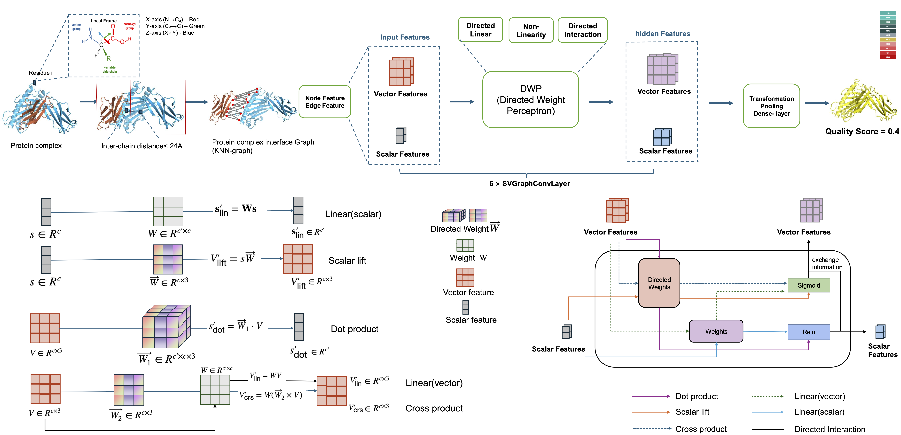

# ORIGAMI: Orientation-Aware Graph Neural Network for Assessing Multimeric Interfaces of Protein Complex Structures

by Xinyu Wang and Debswapna Bhattacharya

[[bioRxiv](https://www.biorxiv.org/content/10.64898/2026.05.31.729128v1)] [[pdf](https://www.biorxiv.org/content/10.64898/2026.05.31.729128v1.full.pdf)]





## Installation

The project requires several ML-specific libraries, it's easier to setup with Anaconda:
1. **Clone the repository**
   ```bash
   git clone https://github.com/Bhattacharya-Lab/ORIGAMI.git
   cd ORIGAMI
   ```
  
2. **Set up the environment**
   ```bash
   conda env create -f origami_environment.yml
   conda activate origami
   ```

3. **Install**
   ```bash
   pip install -e .
   ```
  


## Usage
We provide a command-line interface for ORIGAMI that can easily be used to score protein-protein complexes. The command-line interface can be used as follows:


```bash
$ origami-score -h
usage: origami-score [-h] [--checkpoint CHECKPOINT] [--config CONFIG] [--device DEVICE] [--output OUTPUT] [--json] pdb

Score a protein-protein complex using ORIGAMI.

positional arguments:
  pdb                   Path to the input PDB file containing two chains.

optional arguments:
  -h, --help            show this help message and exit
  --checkpoint CHECKPOINT
                        Path to the pretrained checkpoint (.pt).
  --config CONFIG       YAML configuration used during training.
  --device DEVICE       Torch device identifier (e.g. cuda, cuda:0, cpu).
  --output OUTPUT       Optional path to write the prediction score as JSON.
  --json                Print the prediction as JSON instead of a plain float.
```

Example, score the H1245TS028_4.pdb complex (in ORIGAMI/example)
```bash
$ conda activate origami
(origami) $ origami-score ORIGAMI/example/H1245TS028_4.pdb
(origami) $ origami-score /home/grads/xinyu0110/ORIGAMI/example/H1245TS028_4.pdb
Predicted iLDDT for protein complex H1245TS028_4.pdb is: 0.752040
```
From the output above you can see that the predicted iLDDT for the H1245TS028_4 complex is 0.752040

<!--## Citation
If you use ORIGAMI in your research, please cite:
```

```
-->


## Contact
For questions or collaboration requests, reach out to the maintainers:
- Xinyu Wang — Virginia Tech — `xinyu0110@vt.edu`


